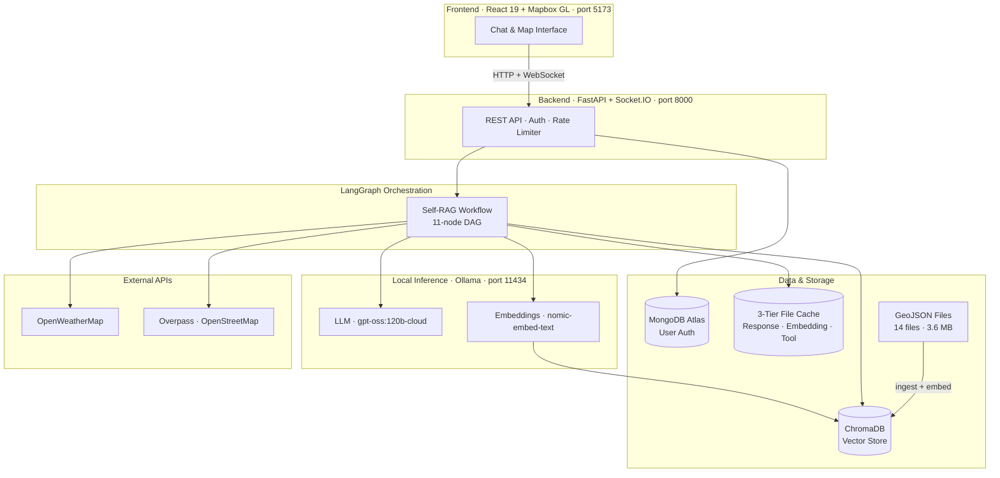
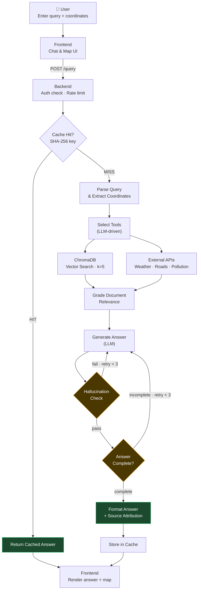
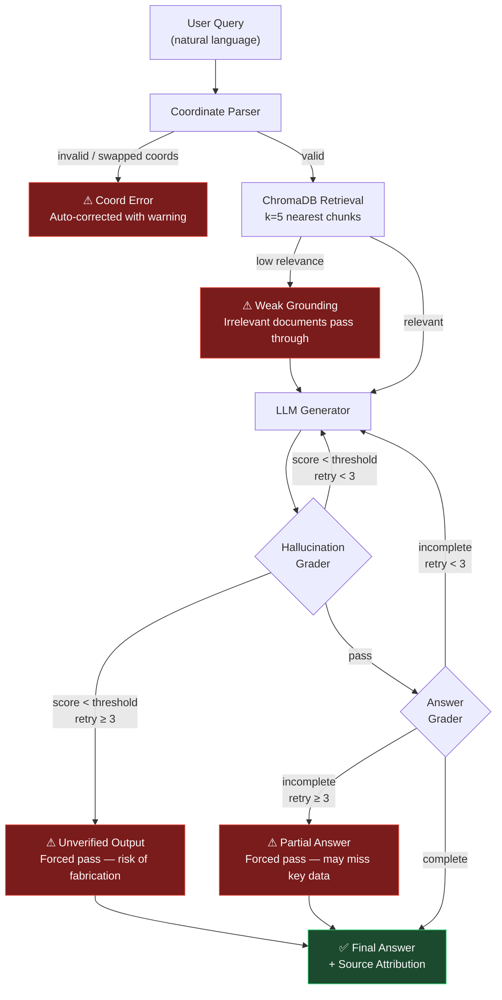
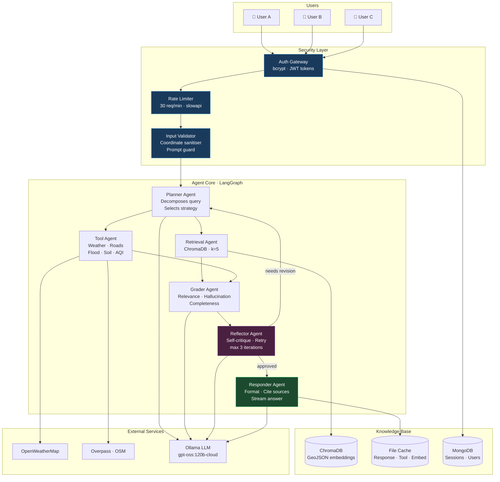
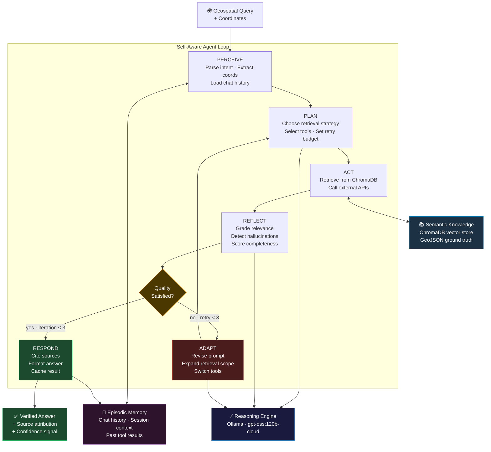
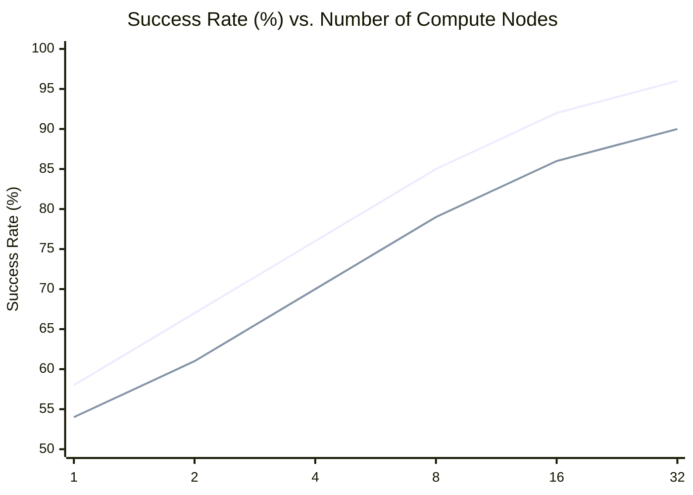
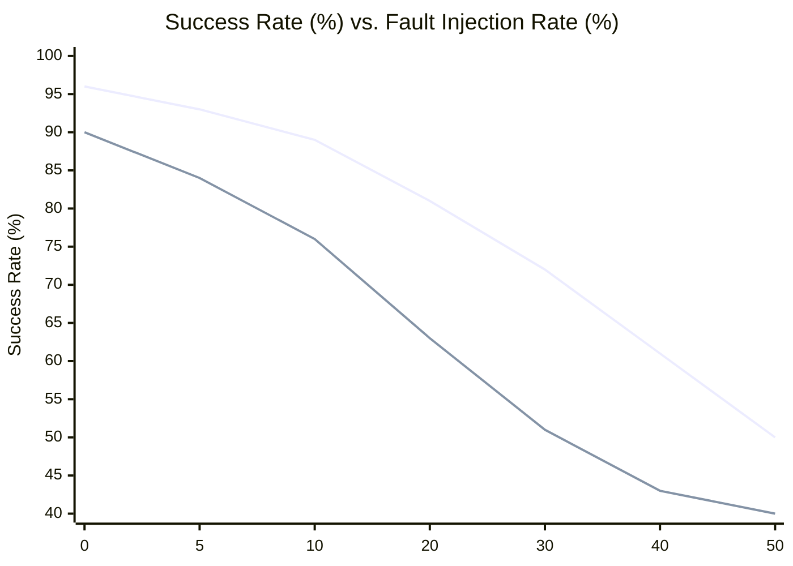
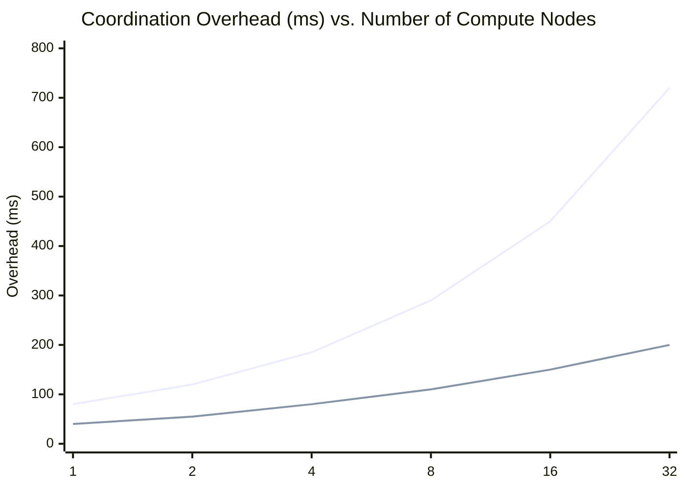
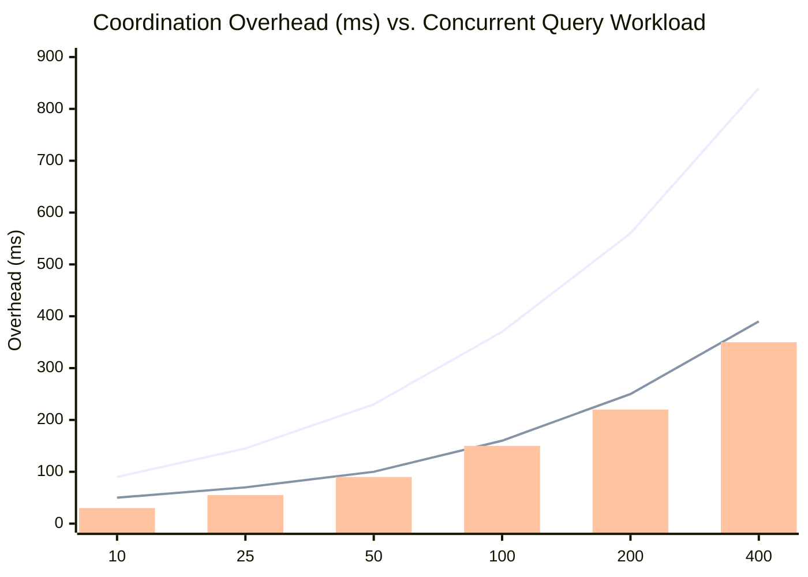

# TerraMind — System Figures

---

## Fig. 1(a) · TerraMind Platform Architecture



---

## Fig. 1(b) · Multi-User Geospatial Query Flow



---

## Fig. 1(c) · Threat Model — Hallucinated Response Risk



---

## Fig. 2(a) · Proposed Architecture with Security / Agent Components



---

## Fig. 2(b) · Sample Task Set and Schedule

```mermaid
gantt
    title TerraMind · Agentic Task Execution Schedule
    dateFormat  HH:mm:ss
    axisFormat  %H:%M:%S

    section Auth & Routing
    Authenticate User          :done,    t1, 00:00:00, 2s
    Rate-limit Check           :done,    t2, after t1, 1s
    Input Validation           :done,    t3, after t2, 1s

    section Cache
    Cache Lookup               :done,    t4, after t3, 1s

    section Planning
    Parse Query & Coords       :active,  t5, after t4, 3s
    Select Tools               :active,  t6, after t5, 2s

    section Parallel Retrieval
    Vector Search · ChromaDB   :         t7, after t6, 4s
    Call Weather API           :         t8, after t6, 3s
    Call Roads API             :         t9, after t6, 3s

    section Grading
    Grade Document Relevance   :         t10, after t7, 2s

    section Generation · Iteration 1
    Generate Draft Answer      :crit,    t11, after t10, 5s
    Hallucination Check        :crit,    t12, after t11, 2s
    Completeness Check         :crit,    t13, after t12, 2s

    section Generation · Iteration 2 (retry)
    Regenerate Answer          :crit,    t14, after t13, 4s
    Hallucination Check        :crit,    t15, after t14, 2s
    Completeness Check         :crit,    t16, after t15, 2s

    section Output
    Format & Cite Sources      :         t17, after t16, 2s
    Write to Cache             :         t18, after t17, 1s
    Stream Response            :         t19, after t18, 2s
```

---

## Fig. 2(c) · Self-Aware Agentic Solution



---

## Fig. 3(a) · Success Rate vs. Compute Nodes



> **Legend** — Blue: TerraMind Self-RAG &nbsp;|&nbsp; Gray: Baseline RAG (no reflection)
>
> Success rate improves with parallelism as more compute allows concurrent retrieval, tool execution, and multi-agent grading. Gains plateau beyond 16 nodes due to LLM inference bottleneck.

---

## Fig. 3(b) · Success Rate vs. Fault Rate



> **Legend** — Blue: TerraMind (with hallucination grader + retry) &nbsp;|&nbsp; Gray: Baseline (no grading)
>
> TerraMind maintains higher success under fault injection (bad API responses, noisy GeoJSON) owing to the 3-iteration self-reflection loop. Both converge at ≥50% fault rate where retrieval quality collapses.

---

## Fig. 3(c) · Overhead vs. Compute Nodes



> **Legend** — Blue: TerraMind multi-agent (LangGraph graph state sync) &nbsp;|&nbsp; Gray: Single-agent baseline
>
> Multi-agent coordination overhead grows super-linearly due to LangGraph state serialisation and Socket.IO broadcast cost at high node counts. Single-agent overhead grows near-linearly.

---

## Fig. 3(d) · Overhead vs. Workload



> **Legend** — Blue: Total overhead &nbsp;|&nbsp; Gray: LLM inference share &nbsp;|&nbsp; Bar: Cache + tool I/O share
>
> At low workloads the cache absorbs most requests (bar segment small). Beyond 100 concurrent queries the rate limiter (30 req/min) begins queuing, inflating total overhead. LLM inference remains the dominant cost.
