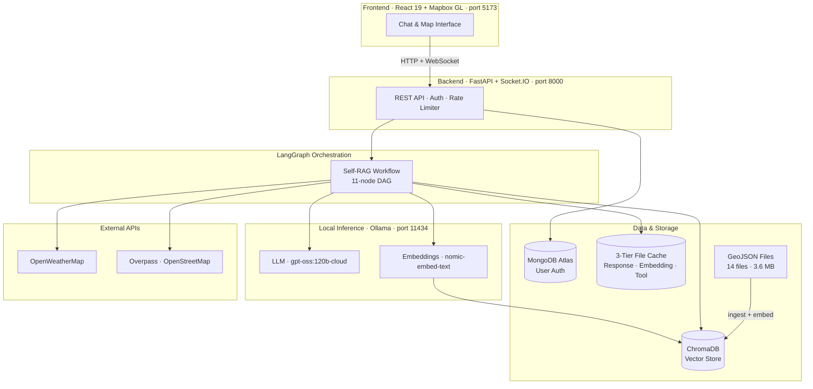
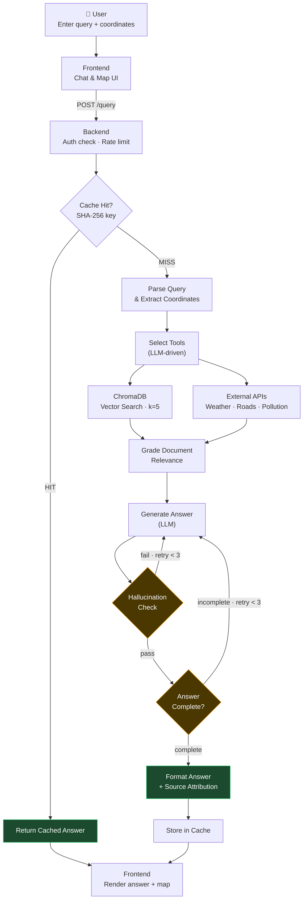
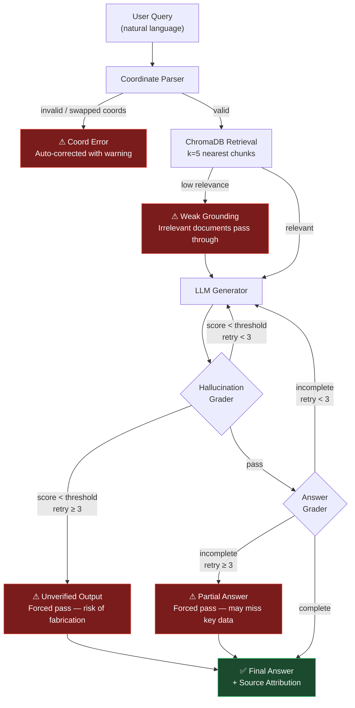

# Fig. 1 · System Overview

---

## Fig. 1(a) · TerraMind Platform Architecture

---

## Fig. 1(b) · Multi-User Geospatial Query Flow

---

## Fig. 1(c) · Threat Model — Hallucinated Response Risk

