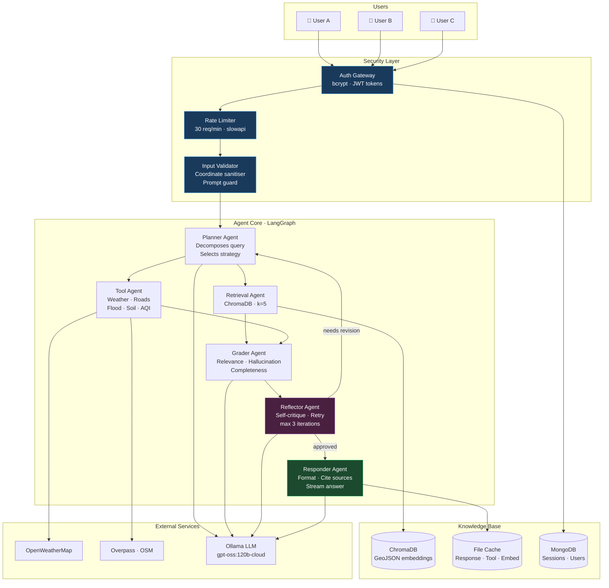
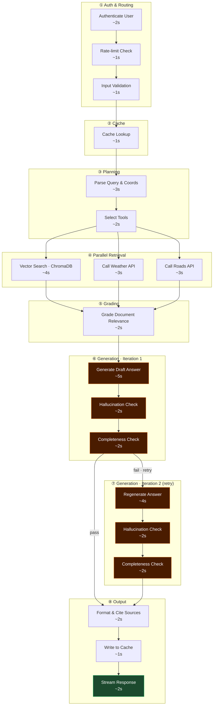
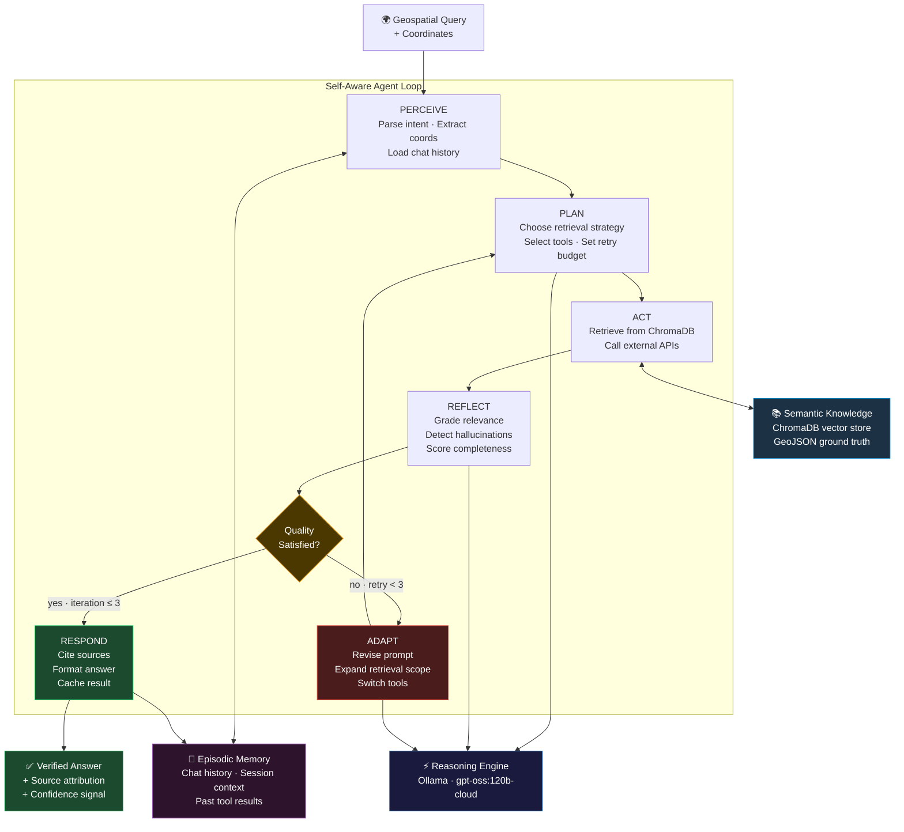

# Fig. 2 · Agent Architecture

---

## Fig. 2(a) · Proposed Architecture with Security / Agent Components

---

## Fig. 2(b) · Sample Task Set and Schedule

---

## Fig. 2(c) · Self-Aware Agentic Solution

