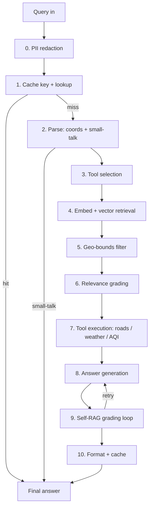

# TerraMind — The Mathematics of the Pipeline

This document walks through **every mathematical operation** in the TerraMind
land-analysis system, in the order a query travels through it — from the moment
text enters the backend to the moment a formatted answer leaves it.

Formulas are given in standard notation and cross-referenced to the source file
that implements them. Operations performed by external services (the embedding
model, the LLM, and Open-Meteo's AQI) are marked **[external]** but included so
the full chain is visible.

---

## 0. Notation & constants

| Symbol | Meaning | Value / source |
|--------|---------|----------------|
| $\varphi$ | latitude (radians unless noted) | — |
| $\lambda$ | longitude (radians unless noted) | — |
| $R$ | Earth mean radius | $6371\ \text{km}$ |
| $R_\text{bound}$ | geo-bounds radius | $75\ \text{km}$ (`GEO_BOUNDS_RADIUS_KM`) |
| $k$ | documents returned to the generator | $5$ (`RETRIEVAL_K`) |
| $k'$ | candidates fetched before geo-filtering | $20$ (`RETRIEVAL_FETCH_K`) |
| $\tau$ | cache time-to-live | $24\ \text{h}$ (`CACHE_TTL_HOURS`) |
| $T$ | LLM sampling temperature | $0$ (`LLM_TEMPERATURE`) |
| $r_\max$ | max generation retries | $3$ (`MAX_GENERATION_RETRIES`) |
| $r_m$ | tool search radius | $1000$–$2000\ \text{m}$ |
| $D$ | embedding dimension (nomic-embed-text) | $768$ |

### Pipeline overview

---

## 1. Cache key & expiry
`src/utils/cache_manager.py`

Every query, embedding and tool result is keyed by a **SHA-256** digest of its
canonical JSON form (keys sorted so the mapping is order-independent):

$$
\text{key} = \operatorname{SHA256}\big(\operatorname{JSON}_{\text{sorted}}(\text{data})\big) \in \{0,1\}^{256}
$$

A cached entry at modification time $t_\text{mtime}$ is considered **expired**
when

$$
t_\text{now} - t_\text{mtime} > \tau, \qquad \tau = 24\ \text{h}.
$$

The embedding cache key mixes in the rounded query location so the same question
at different places never collides:

$$
\text{geo\_key} = \big(\operatorname{round}(\varphi_q, 3),\ \operatorname{round}(\lambda_q, 3)\big).
$$

---

## 2. Query parsing

### 2.1 Coordinate validity
`src/utils/coordinate_parser.py`

Extracted coordinates are accepted only inside the valid geographic ranges:

$$
-90 \le \varphi \le 90 \qquad\text{and}\qquad -180 \le \lambda \le 180 .
$$

Order disambiguation: given two parsed reals $(v_1, v_2)$, the pair is read as
$(\varphi,\lambda)=(v_1,v_2)$ if $|v_1|\le 90 \wedge |v_2|\le 180$; otherwise the
pair is swapped if $|v_2|\le 90 \wedge |v_1|\le 180$.

### 2.2 Small-talk classifier
`src/graph/nodes.py`

Let $\mathcal{T}(m)$ be the set of lowercased word tokens of message $m$ and
$V_\text{small}$ the small-talk vocabulary. The message short-circuits the
pipeline (a greeting) iff

$$
\big|\mathcal{T}(m)\big| \le 6 \quad\wedge\quad \mathcal{T}(m) \subseteq V_\text{small}.
$$

This is pure set membership — **no LLM call** — which is why greetings return in
~0 model calls instead of ~9.

---

## 3. Tool selection **[external LLM]**
`src/tools/tool_selector.py`

A language model chooses the tool set. Token probabilities come from the softmax
over logits $z$ with temperature $T$:

$$
P(x_t = w \mid x_{<t}) = \frac{\exp(z_w / T)}{\sum_{w'} \exp(z_{w'} / T)} .
$$

TerraMind runs at $T = 0$, the zero-temperature limit, which collapses the
distribution to a deterministic **greedy** choice:

$$
x_t = \arg\max_{w} \; z_w .
$$

So identical inputs yield identical tool selections (reproducible pipeline).

---

## 4. Retrieval — embeddings & vector search
`src/rag/rag_pipeline.py` **[embeddings external]**

### 4.1 Embedding

The query text is mapped to a dense vector by the embedding model:

$$
E : \text{text} \longrightarrow \mathbf{q} \in \mathbb{R}^{D}, \qquad D = 768 .
$$

Each stored GeoJSON feature was embedded the same way into $\mathbf{d}_i$.

### 4.2 Similarity

Nearest neighbours are ranked by vector distance. The two standard measures
(cosine similarity and squared Euclidean / L2, Chroma's default) are:

$$
\cos(\mathbf{q}, \mathbf{d}) = \frac{\mathbf{q}\cdot\mathbf{d}}{\lVert \mathbf{q}\rVert\,\lVert \mathbf{d}\rVert},
\qquad
d_{L2}^2(\mathbf{q}, \mathbf{d}) = \lVert \mathbf{q} - \mathbf{d}\rVert^2 .
$$

For $\ell_2$-normalized embeddings the two are monotonically linked, so the
ranking is identical:

$$
\lVert \mathbf{q} - \mathbf{d}\rVert^2 = 2\big(1 - \cos(\mathbf{q}, \mathbf{d})\big).
$$

### 4.3 k-nearest-neighbour selection

The retriever returns the $k'$ features with the smallest distance:

$$
\mathcal{D}_{k'} = \operatorname*{arg\,min}_{S \subseteq \mathcal{D},\ |S| = k'} \; \sum_{\mathbf{d}\in S} d_{L2}^2(\mathbf{q}, \mathbf{d}),
$$

with $k' = 20$ when geo-filtering is active (over-fetch), otherwise $k' = k = 5$.

---

## 5. Geo-bounds filtering
`src/rag/rag_pipeline.py`

This is the stage that keeps answers on-location.

### 5.1 Feature centroid

For a geometry with vertex coordinates $\{(\lambda_i, \varphi_i)\}_{i=1}^{n}$
(Point, Polygon, MultiPolygon, …), the centroid is the arithmetic mean of the
vertices:

$$
\big(\bar\varphi,\ \bar\lambda\big) = \left(\frac{1}{n}\sum_{i=1}^{n}\varphi_i,\ \ \frac{1}{n}\sum_{i=1}^{n}\lambda_i\right).
$$

### 5.2 Haversine great-circle distance

The distance between the query point $q=(\varphi_q,\lambda_q)$ and a feature
centroid $c=(\varphi_c,\lambda_c)$ (angles in radians,
$\Delta\varphi=\varphi_c-\varphi_q$, $\Delta\lambda=\lambda_c-\lambda_q$):

$$
a = \sin^2\!\left(\frac{\Delta\varphi}{2}\right) + \cos\varphi_q\,\cos\varphi_c\,\sin^2\!\left(\frac{\Delta\lambda}{2}\right)
$$

$$
d(q, c) = 2R\,\arcsin\!\big(\sqrt{a}\big).
$$

(`road_tool.py` uses the algebraically equivalent `atan2` form
$d = 2R\,\operatorname{atan2}(\sqrt{a},\sqrt{1-a})$.)

### 5.3 Bounding predicate

A retrieved document is **kept** iff its centroid lies within the radius:

$$
\text{keep}(d) \iff d(q, c_d) \le R_\text{bound}, \qquad R_\text{bound} = 75\ \text{km}.
$$

Documents with no parseable geometry are kept (they cannot be attributed to a
wrong place). The kept set is then truncated to the top $k$ by similarity rank.

---

## 6. Document relevance grading
`src/graph/nodes.py`

Each of the $k'$ candidates gets a binary relevance grade $g_i \in \{0,1\}$ from
a grader model, evaluated **in parallel**. The filtered corpus and the coarse
relevance flag are:

$$
\mathcal{D}^{+} = \{\, d_i : g_i = 1 \,\}, \qquad
\text{relevance} =
\begin{cases}
\text{pass}, & |\mathcal{D}^{+}| > 0 \\[2pt]
\text{fail}, & |\mathcal{D}^{+}| = 0 .
\end{cases}
$$

**Cost/latency note.** Grading $n$ documents sequentially costs $n$ round-trips
of latency $\ell$: $T_\text{seq} = n\,\ell$. Running them concurrently with a
pool of $p$ workers reduces this to

$$
T_\text{par} \approx \left\lceil \frac{n}{p} \right\rceil \ell,
$$

which for $n = p = 5$ collapses $5\ell \to \ell$.

---

## 7. Tool execution — the quantitative core

### 7.1 Road network
`src/tools/road_tool.py`

**Way length.** A road "way" is a polyline of nodes $n_1,\dots,n_m$; its length
sums the haversine distances of consecutive segments:

$$
L_\text{way} = \sum_{i=1}^{m-1} d\big(n_i,\, n_{i+1}\big).
$$

Total length over the set of ways $W$: $\displaystyle L = \sum_{w \in W} L_w$.

**Search area** for radius $r_m$ metres (converted to km):

$$
A = \pi\left(\frac{r_m}{1000}\right)^{2} \quad[\text{km}^2].
$$

**Road density:**

$$
\rho = \frac{L}{A} \quad\left[\frac{\text{km}}{\text{km}^2}\right].
$$

**Node degree and intersections.** With $\deg(v)$ = number of ways containing
node $v$, an intersection is a node where three or more ways meet:

$$
\text{intersections} = \big|\{\, v : \deg(v) \ge 3 \,\}\big|.
$$

**Connectivity score** (bounded to $[0,10]$):

$$
C = \min\!\left(10,\ \operatorname{round}\!\left(\frac{\text{intersections}}{\max(|W|,\,1)}\times 5,\ 1\right)\right).
$$

**Road-type share.** For road class $c$ with count $n_c$ out of $N=\sum_c n_c$:

$$
\text{share}_c = \frac{n_c}{N}\times 100\ \%.
$$

### 7.2 Weather aggregation
`src/tools/weather_tool.py` (data **[external: Open-Meteo]**)

Recent-weather summaries aggregate the hourly series $\{x_h\}_{h\in d}$ per day
$d$:

$$
T^{(d)}_{\min} = \min_{h\in d} T_h, \quad
T^{(d)}_{\max} = \max_{h\in d} T_h, \quad
P^{(d)} = \sum_{h\in d} p_h,
$$

where $T_h$ is hourly temperature and $p_h$ hourly precipitation.

### 7.3 Air-Quality Index **[external: Open-Meteo]**
`src/tools/weather_tool.py`

Open-Meteo returns the US EPA AQI, computed from a pollutant concentration $C$
by **piecewise-linear interpolation** between the breakpoints
$(C_\text{lo}, C_\text{hi})\to(I_\text{lo}, I_\text{hi})$ that bracket $C$:

$$
I = \frac{I_\text{hi} - I_\text{lo}}{C_\text{hi} - C_\text{lo}}\,\big(C - C_\text{lo}\big) + I_\text{lo}.
$$

The reported AQI is the maximum sub-index across pollutants
(PM2.5, PM10, O₃, NO₂, SO₂, CO):

$$
\text{AQI} = \max_{c}\, I_c .
$$

---

## 8. Answer generation **[external LLM]**
`src/chains/generator.py`

The generator is an autoregressive model factorizing the answer sequence
$y = (y_1,\dots,y_L)$ as

$$
P(y \mid \text{context}) = \prod_{t=1}^{L} P\big(y_t \mid y_{<t},\ \text{context}\big),
$$

where *context* = question $\oplus$ graded documents $\oplus$ tool results
$\oplus$ chat history. Each factor is the temperature-scaled softmax of §3; at
$T=0$ decoding is greedy and deterministic.

---

## 9. Self-RAG grading loop
`src/graph/workflow.py`, `src/graph/nodes.py`

Two binary graders gate the answer:

- **Groundedness** $g_h \in \{\text{pass}, \text{fail}\}$ — is the answer
  supported by the documents/tool results?
- **Usefulness** $g_a \in \{\text{pass}, \text{fail}\}$ — does it address the
  question?

With retry counter $r$, the control flow is the bounded recurrence

$$
r_{t+1} =
\begin{cases}
r_t + 1, & (g_h = \text{fail} \ \lor\ g_a = \text{fail}) \ \wedge\ r_t < r_\max \\[4pt]
\text{stop}, & \text{otherwise},
\end{cases}
\qquad r_\max = 3.
$$

Because $r$ strictly increases and is capped at $r_\max$, the loop terminates
after at most $r_\max$ regenerations — the number of generation passes is bounded
by $1 + r_\max = 4$, guaranteeing no infinite loop.

---

## 10. End-to-end cost model

Let $\ell$ be one model round-trip. Counting model calls along the **worst-case**
path (cache miss, non-greeting, one retry each grader):

$$
N_\text{calls} = \underbrace{1}_{\text{tool sel.}} + \underbrace{1}_{\text{embed}} + \underbrace{\left\lceil \tfrac{k'}{p}\right\rceil}_{\text{grading}} + \underbrace{(1+r)}_{\text{generate}} + \underbrace{(1+r)}_{\text{halluc.}} + \underbrace{(1+r)}_{\text{answer}} .
$$

The two big optimizations in the codebase attack this directly:

- **Greeting fast-path** (§2.2): $N_\text{calls} \to 0$ when
  $\mathcal{T}(m)\subseteq V_\text{small}$.
- **Parallel grading** (§6): the grading term drops from $k'$ to
  $\lceil k'/p\rceil$.
- **Disable-graders switches**: setting the hallucination/answer checks off
  removes the corresponding $(1+r)$ terms entirely.

---

## Appendix — where each formula lives

| Stage | Math | File |
|-------|------|------|
| Cache key / TTL | SHA-256, expiry inequality | `src/utils/cache_manager.py` |
| Coordinates | range validity | `src/utils/coordinate_parser.py` |
| Small-talk | set membership | `src/graph/nodes.py` |
| Tool selection | softmax / argmax | `src/tools/tool_selector.py` |
| Retrieval | embedding, cosine/L2, k-NN | `src/rag/rag_pipeline.py` |
| Geo-bounds | centroid, haversine, threshold | `src/rag/rag_pipeline.py` |
| Grading | binary filter, parallel latency | `src/graph/nodes.py` |
| Roads | way length, area, density, connectivity | `src/tools/road_tool.py` |
| Weather / AQI | min/max/sum, EPA interpolation | `src/tools/weather_tool.py` |
| Generation | autoregressive factorization | `src/chains/generator.py` |
| Self-RAG loop | bounded retry recurrence | `src/graph/workflow.py` |

> **Rendering note.** The `$…$` / `$$…$$` blocks render as math on GitHub and in
> most Markdown viewers with MathJax/KaTeX. In editors without math support they
> appear as LaTeX source.
