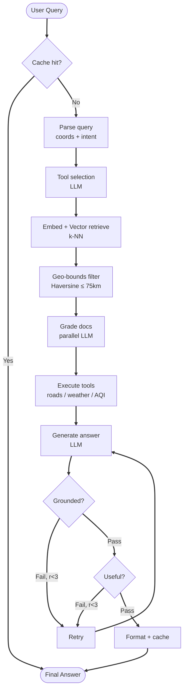
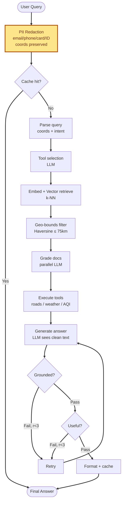
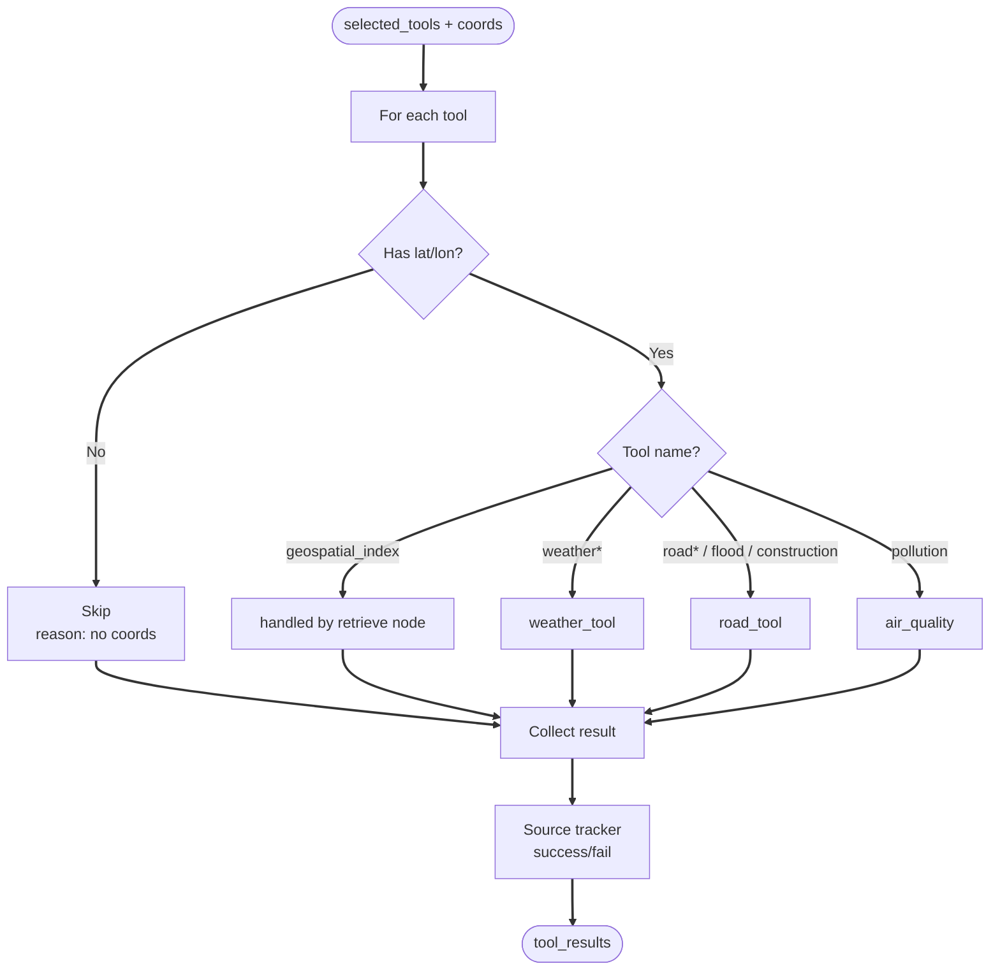
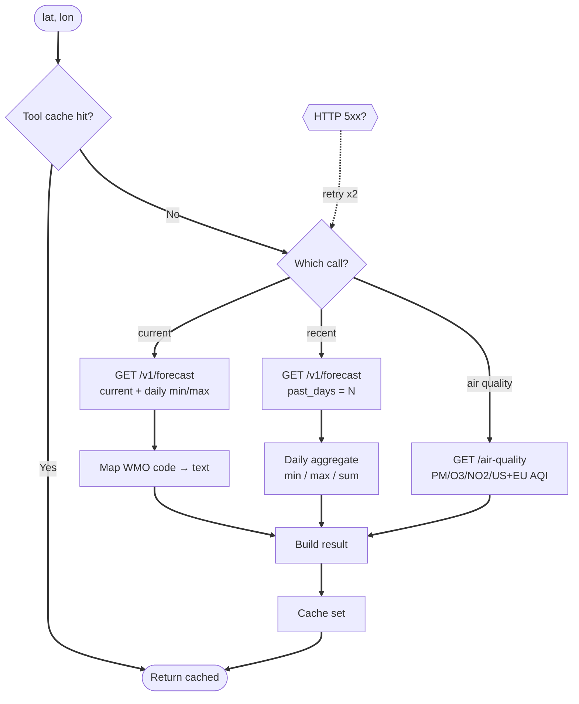
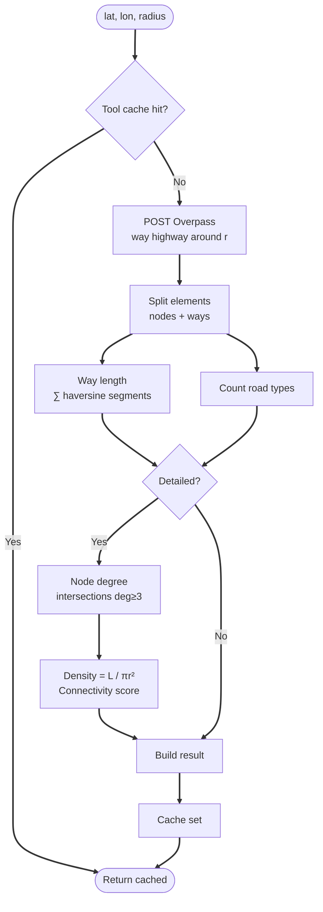
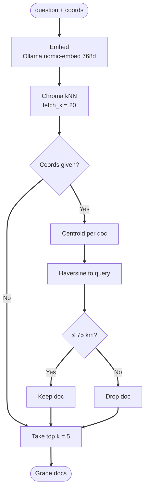
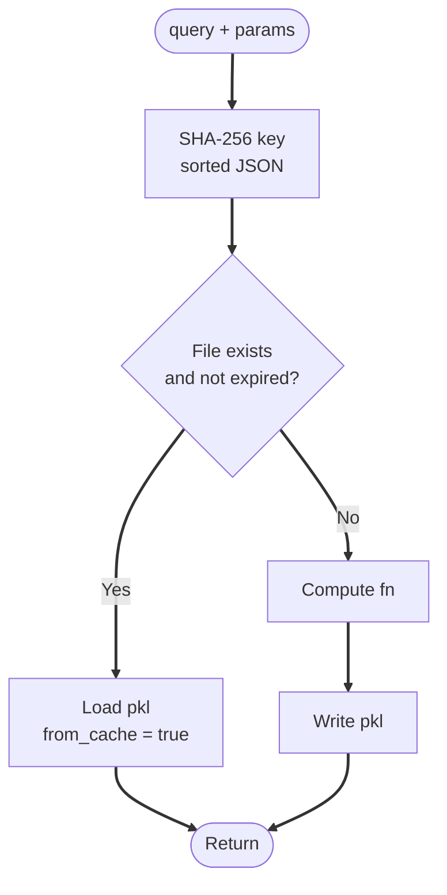
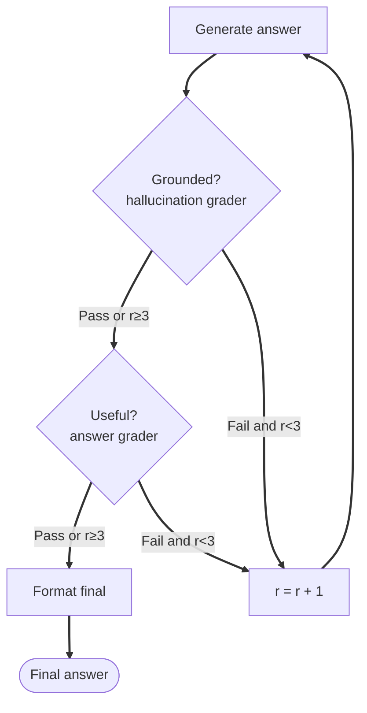
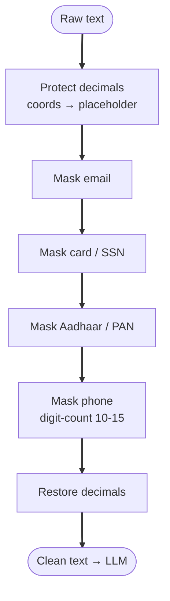

# TerraMind — System Flow Diagrams

Two diagrams. Same pipeline. One **without** PII filter, one **with**.
Tuned for **1024×768 (XGA)**: vertical spine, big font (22px), wide spacing → no line overlap, readable from far.

> Render: GitHub / any Mermaid viewer. Vertical flow fits 1024 width; scroll down for full height.

---

## 1. Without PII Filter

Raw query → straight into cache + graph. Personal data reaches LLM.



<p align="center"><b>Fig 1 — TerraMind Pipeline (Without PII Filter)</b></p>

---

## 2. With PII Filter

Redact **before** cache + graph. Coords kept. LLM never see personal data.



<p align="center"><b>Fig 2 — TerraMind Pipeline (With PII Filter)</b></p>

---

## Diff

| Point | No PII | With PII |
|-------|--------|----------|
| First step | Cache check | **Redact** then cache |
| LLM input | raw text (leak risk) | clean text |
| Coords | kept | kept (decimals protected) |
| Extra nodes | 0 | 1 (`PII Redaction`) |
| Masked | — | email · phone · card · SSN · Aadhaar · PAN |

## Notes

- Spine vertical → edges parallel, no cross.
- Only back-edge = `Retry → Generate`. Mermaid route left, no overlap.
- Font 24px, nodeSpacing 70, rankSpacing 80 → far-readable on XGA.
- Yellow node = security gate (with-PII only).

---

## 3. Tool Dispatch — `execute_tools`

Selected tools loop. Coords required for API tools. Results → source tracker.



<p align="center"><b>Fig 3 — Tool Dispatch Map</b></p>

---

## 4. Weather + Air Quality Tool — Open-Meteo (no key)

Cache-first. Retry 5xx. WMO code → text.



<p align="center"><b>Fig 4 — Weather &amp; Air-Quality Tool (Open-Meteo)</b></p>

---

## 5. Road Network Tool — Overpass / OpenStreetMap (no key)

Query roads in radius. Compute length, density, connectivity.



<p align="center"><b>Fig 5 — Road Network Tool (Overpass/OSM)</b></p>

---

## 6. RAG Retrieval + Geo-bounds

Embed → vector kNN → keep near docs only.



<p align="center"><b>Fig 6 — RAG Retrieval + Geo-bounds Filter</b></p>

> **← COMBINED SCORE FORMULA LIVES HERE** (midterm p.7). Retrieval blends semantic match + geographic proximity:
>
> `Combined Score = α · Cosine_Similarity + (1 − α) · Distance_Score`
>
> - `α ∈ [0,1]` — trust text vs distance. `α=1` → text only, `α=0` → distance only.
> - Retrieve if `Combined ≥ 0.75` (threshold).
> - Example: `0.7·0.96 + 0.3·0.448 = 0.806 ≥ 0.75` → retrieved.
>
> In code today: Cosine_Similarity = vector kNN score; Distance_Score derives from the Haversine geo-bounds (§5). `α` = blend weight.

---

## 7. Cache Manager — `get_or_compute`

Disk pkl. SHA-256 key. 24h TTL.



<p align="center"><b>Fig 7 — Cache Manager</b></p>

---

## 8. Self-RAG Grading Loop

Two graders gate answer. Bounded retry r &lt; 3.



<p align="center"><b>Fig 8 — Self-RAG Grading Loop</b></p>

---

## 9. PII Redaction Internals

Protect coords first. Then mask PII. Then restore.



<p align="center"><b>Fig 9 — PII Redaction Internals</b></p>

---

## 10. Hallucination Check — Step by Step

Groundedness gate. Ask: does answer stick to facts, or invent stuff?
Decision tree — terminal outcomes, no crossing lines.

```mermaid
%%{init: {'theme':'base','themeVariables':{'fontSize':'24px','fontFamily':'Segoe UI, Arial','lineColor':'#166534','primaryColor':'#dcfce7','primaryBorderColor':'#16a34a','primaryTextColor':'#0f172a'},'flowchart':{'nodeSpacing':75,'rankSpacing':85,'curve':'basis','htmlLabels':true}}%%
flowchart TD
    GEN([generation + facts]) --> EN{Check enabled?}
    EN -->|No| P1[[PASS &middot; check off]]
    EN -->|Yes| SRC{Grounding source?}
    SRC -->|none| P2[[PASS &middot; skip, no source]]
    SRC -->|docs, else tools| C1{1&#46; Consistent<br/>with facts?}
    C1 -->|No, contradicts| F[[FAIL &middot; not grounded]]
    C1 -->|Yes| C2{2&#46; Fabricated<br/>data present?}
    C2 -->|Yes, invented| F
    C2 -->|No| C3{3&#46; Inference<br/>reasonable?}
    C3 -->|Yes| P3[[PASS &middot; grounded]]

    linkStyle default stroke-width:2.5px
```



<p align="center"><b>Fig 10 — Hallucination Check (step by step)</b></p>

> **Outcome routing** (not drawn, keeps tree clean):
> **PASS** → answer grader (Fig 8). **FAIL** → retry if `r < 3` (regenerate), else proceed anyway.

---

## 10a. Hallucination Check — Detail

**What.** Self-RAG groundedness gate. `check_hallucination` node + `hallucination_grader` chain. Stop model inventing facts.

**Inputs.** `generation` (answer text) + `facts` (grounding material).

**Step 0 — Enable flag.** `HALLUCINATION_CHECK_ENABLED` off → return `pass`, skip LLM. Speed knob.

**Step 1 — Pick grounding source** (`nodes.py`):

| Condition | `facts` = | Why |
|-----------|-----------|-----|
| documents survived grading | joined documents | primary source |
| no docs, but tool results | joined tool results | geo-bounds dropped all docs → weather/road/AQI still valid |
| neither | — | **skip → pass** (no source → grading impossible → avoid infinite retry) |

**Step 2 — LLM grader.** `facts` + `generation` → grader model (temp 0, deterministic) → JSON `{"binary_score":"yes"|"no"}`.

**Step 3 — 3 criteria** (`hallucination_grader.py` system prompt):

| # | Criterion | `yes` (grounded) | `no` (hallucinated) |
|---|-----------|------------------|----------------------|
| 1 | **Consistency** | uses info matching facts (soil, terrain, weather, land use) | claim **directly contradicts** source |
| 2 | **Fabrication** | no invented specifics | invents location / coords / measurement **not in facts anywhere** |
| 3 | **Inference** | reasonable inference from partial data = still grounded | — |

**Lenient bias (key).** Sparse or incomplete facts alone do **not** fail. Fail **only** on contradiction or fabrication. Stops over-rejecting good partial answers.

### Formula model — how grounded / fabricated is measured (midterm p.8)

Conceptual Self-RAG reflection score. Code today realizes it with the LLM binary grader; the formula is the design intent behind that yes/no:

```
Confidence = Support · (1 − Contradiction) · Completeness
```

| Term | Formula | What it checks |
|------|---------|----------------|
| **Support** | `cosine(source, claim)` | **grounded?** — retrieved facts back the claim. High = grounded. |
| **Contradiction** | `max cosine(claim, opposing_clause)` | **fabricated / conflicting?** — is there any retrieved clause that opposes the claim. High = not grounded. |
| **Completeness** | `answered_questions / required_questions` | coverage of required info |

- **Grounded check** = criterion 1 (Consistency) = high **Support**, low **Contradiction**.
- **Fabrication check** = criterion 2 = the **Contradiction** term (`(1 − Contradiction)` factor): claim aligns with an opposing clause → factor → 0 → Confidence collapses.
- Low `Confidence` (below threshold) → **auto re-retrieval / retry** (Fig 8 loop).
- Example: `Support=0.94, Contradiction=0.82, Completeness=0.50` → `0.94·(1−0.82)·0.50 = 0.085` → low → re-retrieve.

**Formula → diagram map:**

| Formula | Source | Used in |
|---------|--------|---------|
| `Combined = α·Cosine + (1−α)·Distance` | p.7 | **Fig 6** (retrieval) |
| `Confidence = Support·(1−Contradiction)·Completeness` | p.8 | **Fig 8 + Fig 10** (this check) |
| `Precision@K`, `Cosine` | p.5–6 | **Fig 6** (retrieval eval) |
| `Haversine ≤ 75 km` | code | **Fig 5, Fig 6** |
| `Density = L/πr²`, `Connectivity` | code | **Fig 5** (roads) |

**Step 4 — Map score.** `binary_score == "yes"` (or bool `True`) → `pass`. Else → `fail`.

**Step 5 — Route** (`workflow.py`):

- `pass` → answer grader.
- `fail` **and** `r < 3` → `increment_retry` → regenerate (r ← r+1).
- `fail` **and** `r ≥ 3` → give up gate, proceed with current answer (bounded, no infinite loop).

**Worked examples:**

| Facts | Generation | Score | Why |
|-------|-----------|-------|-----|
| "soil: alluvial, AQI 64" | "Alluvial soil, moderate air (AQI 64)" | `yes` | consistent |
| "soil: alluvial" | "Rocky basalt terrain" | `no` | contradicts (crit 1) |
| "AQI 64" | "Population 2.3M, metro rail line 4" | `no` | fabricated, not in facts (crit 2) |
| "temp 29°C, humid" | "Warm humid; likely uncomfortable midday" | `yes` | reasonable inference (crit 3) |
| (all docs geo-dropped) | any | `pass` | no source → skip |

---

## Figure Index

| Fig | Name |
|-----|------|
| 1 | Pipeline — Without PII Filter |
| 2 | Pipeline — With PII Filter |
| 3 | Tool Dispatch Map |
| 4 | Weather &amp; Air-Quality Tool (Open-Meteo) |
| 5 | Road Network Tool (Overpass/OSM) |
| 6 | RAG Retrieval + Geo-bounds |
| 7 | Cache Manager |
| 8 | Self-RAG Grading Loop |
| 9 | PII Redaction Internals |
| 10 | Hallucination Check (step by step) |
