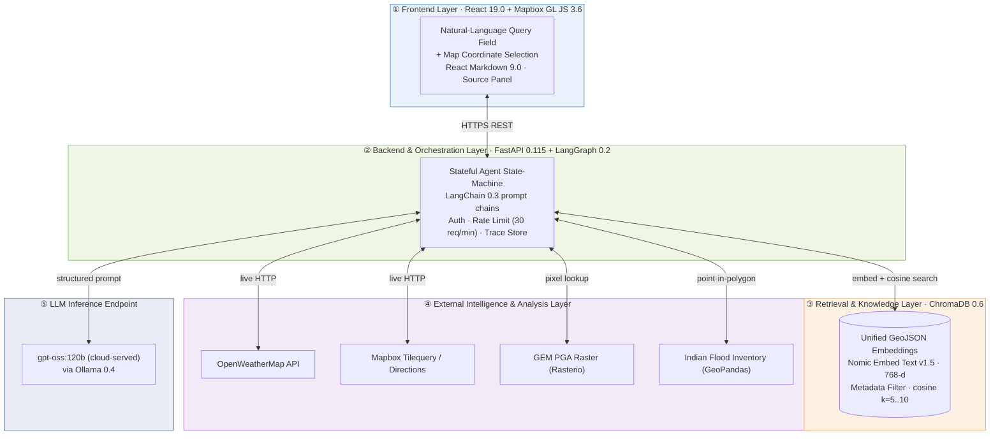
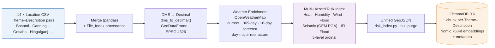
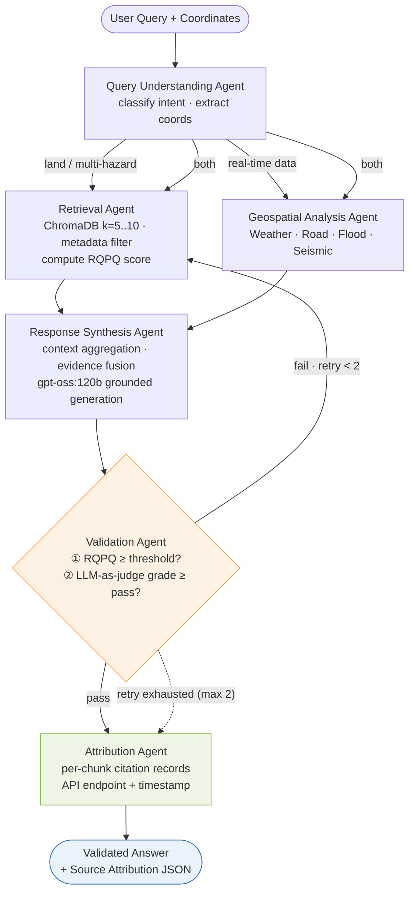

# TerraMind Paper Diagrams

## Fig. 1 · TerraMind System Architecture (Five Layers)

---

## Fig. 2 · Dataset Construction and Knowledge-Base Pipeline

---

## Fig. 3 · LangGraph Agentic Workflow — State Machine

